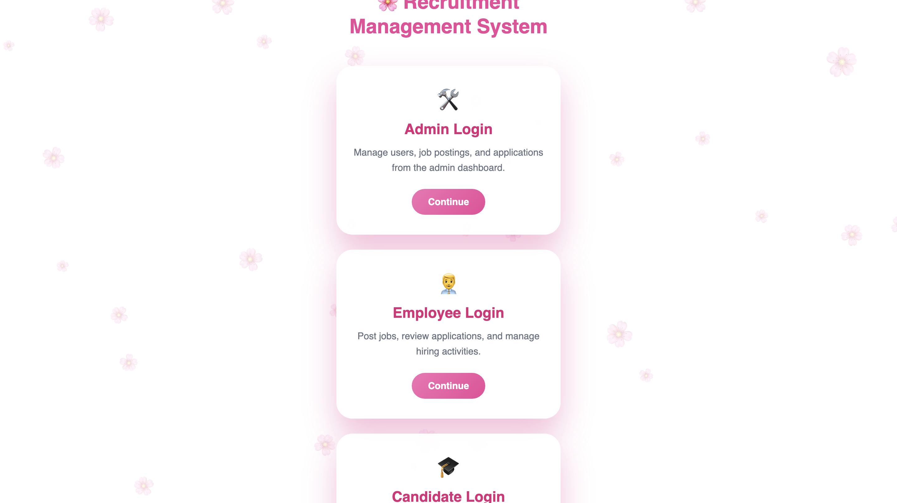
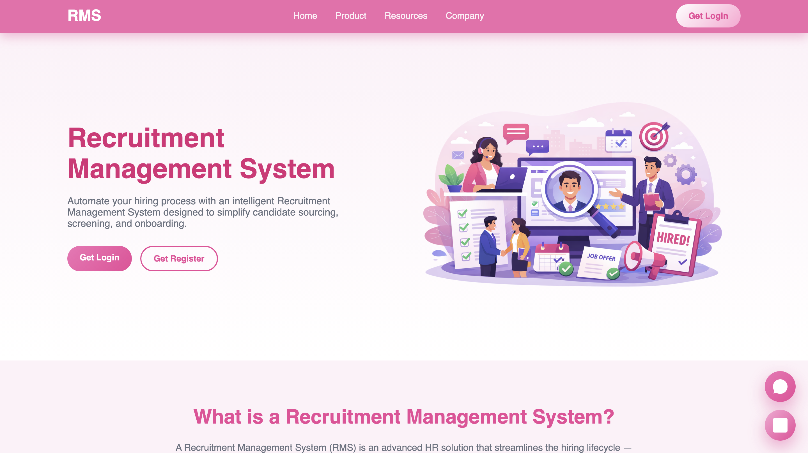
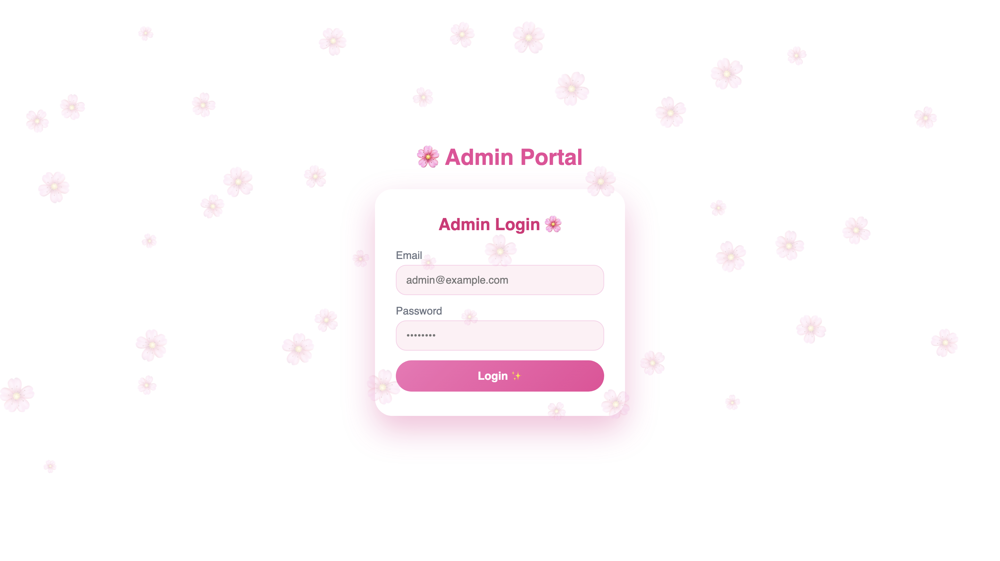
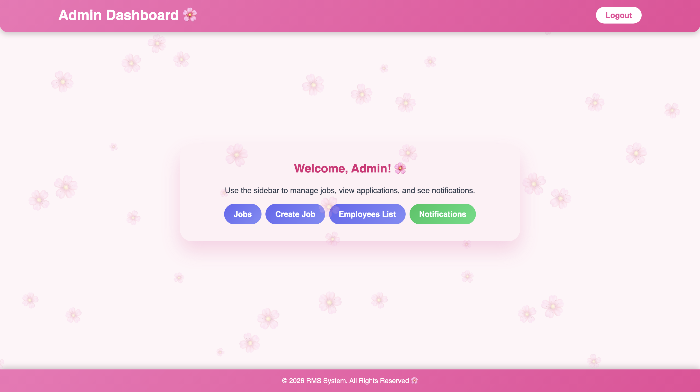

# 👥 Recruitment Management System

A web-based Recruitment Management System developed using **Python**, **Flask**, and **SQLite**. The system streamlines the recruitment process by allowing administrators to manage job postings, applicants, and recruitment workflows through an intuitive web interface.

---

# 🚀 Project Overview

The Recruitment Management System was designed to simplify hiring operations by providing a centralized platform for managing recruitment activities.

It enables administrators to create job openings, review applications, manage applicants, and organize recruitment data efficiently.

---

# ✨ Features

## 👤 User Authentication

- Secure Login System
- Administrator Access
- Session Management

---

## 💼 Job Management

- Create Job Posts
- Edit Job Information
- Delete Job Posts
- View Available Positions

---

## 📝 Applicant Management

- Apply for Jobs
- View Applicant Details
- Manage Recruitment Records
- Search Applicants

---

## 📊 Dashboard

- Recruitment Overview
- Job Listings
- Applicant Records
- Easy Navigation

---

# 🏗️ System Architecture

```
                User
                  │
                  ▼
          Flask Web Application
                  │
        -----------------------
        │                     │
   Authentication      Recruitment Module
        │                     │
        └──────────────┬──────┘
                       ▼
                 SQLite Database
```

---

# 🛠️ Tech Stack

## Backend

- Python
- Flask

## Frontend

- HTML5
- CSS3
- JavaScript
- Jinja2 Templates

## Database

- SQLite

## Tools

- Git
- GitHub
- VS Code

---

# 📂 Project Structure

```
Recruitment-Management-System/

├── app.py
├── create_admin.py
├── init_db.py
├── requirements.txt
├── static/
├── templates/
├── utils/
└── README.md
```

---

# ⚙️ Installation

## Clone Repository

```bash
git clone https://github.com/UsairamPasha/recruitment-management-system.git
```

## Navigate to Project

```bash
cd recruitment-management-system
```

## Create Virtual Environment

```bash
python -m venv venv
```

Activate:

### Windows

```bash
venv\Scripts\activate
```

### macOS/Linux

```bash
source venv/bin/activate
```

## Install Dependencies

```bash
pip install -r requirements.txt
```

## Initialize Database

```bash
python init_db.py
```

## Run Application

```bash
python app.py
```

Open:

```
http://127.0.0.1:5000
```

---

# 📸 Screenshots

## 🏠 Landing Page



---

## 🏡 Home Page



---

## 🔑 Login Page



---

## 📊 Dashboard




---

# 🔮 Future Improvements

- Email Notifications
- Resume Upload Support
- Interview Scheduling
- Role-Based Access Control
- Advanced Search & Filters
- Reporting Dashboard

---

# 👨‍💻 Developer

**Muhammad Usairam Pasha**

BS Computer Science Student

Python Developer | Flask Developer | Django Developer | AI & Machine Learning Enthusiast

📍 Pakistan

📧 Shubanapasha@gmail.com
